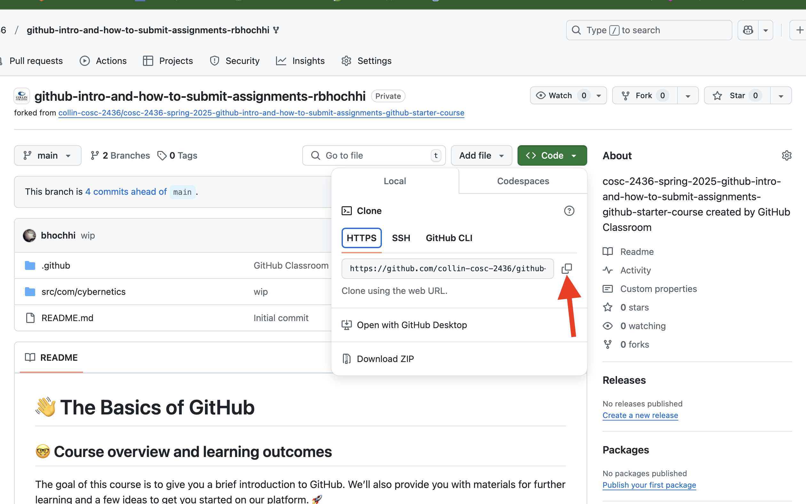
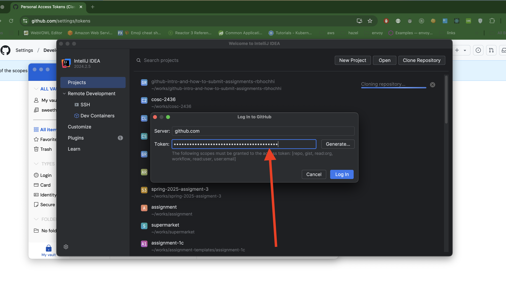

### Exercise: Step-by-Step GitHub Classroom Guide to submit assignment

1. GitHub Account Setup: 
   - Create a GitHub account at https://github.com if you don't have one yet.
   
2. Joining the Classroom 
   - Click on the GitHub Classroom invitation link provided by the professor: https://classroom.github.com/a/YNAj6bd- 
   
   - Authorize GitHub Classroom to access your GitHub account, Select your name/student ID from the roster
   - This automatically creates a personal repository for assignments
   
3. Accepting Assignments
   - When professor posts a new assignment, click "Accept this assignment"
   - GitHub Classroom will generate a personal repository for that specific assignment
   - Repository name typically follows format: `<course-name>-<assignment-name>-<your-username>`
   
   

4. Cloning the Repository Directly  using Intellij IDE
- open your repository and copy the clone url
   
- Open your Intellij IDE and select new project from Version Control...
 
- Paste the clone url that you copied above 
 
- Then you will asked to login Github, select `Use Token...`
 
- Select `Generate...`

- you will be landed into github token page, after you are logged in. Here you can choose to update the expiration dates as default is just 30 days. 

- At the bottom, you have `Generate token` button. click that!

- you will then see the token. Remember you will see this token only once. So copy that token.

- Go back to your IDE, where you paste this token. And `Log In`

- That should download the repository project. 
- 

Alternative way if you are commandline person: 
- Open terminal/command prompt
- Use Git command: `git clone <repository-url>`
- Navigate into repository: `cd <repository-folder>`

 
5. Working on Assignment
- Make changes to code files
- Use Git commands to track progress:
   - `git add .` (stage all changes)
   - `git commit -m "Descriptive commit message"`
   - `git push origin main`

6. Submitting on Canvas
- Copy repository URL from GitHub
- Paste repository link in Canvas assignment submission
- Ensure all required files are pushed to GitHub


```java
public class HelloStudent {
    public static void main(String[] args) {
        // Allow customization of student name
        String studentName = "Student";
        
        // Check if a name argument is provided
        if (args.length > 0) {
            studentName = args[0];
        }
        
        // Print personalized greeting
        System.out.println("Hello " + studentName + "!");
    }
}

```

Compilation and Run Instructions:
- Compile: `javac HelloStudent.java`
- Run without name: `java HelloStudent`
- Run with name: `java HelloStudent "John Doe"`

Recommended Repository Structure:
```
assignment-repo/
│
├── src/
│   └── HelloStudent.java
├── README.md
└── .gitignore
```

Key Tips:
- Commit frequently
- Write clear commit messages
- Push code regularly
- Check Canvas for specific submission instructions